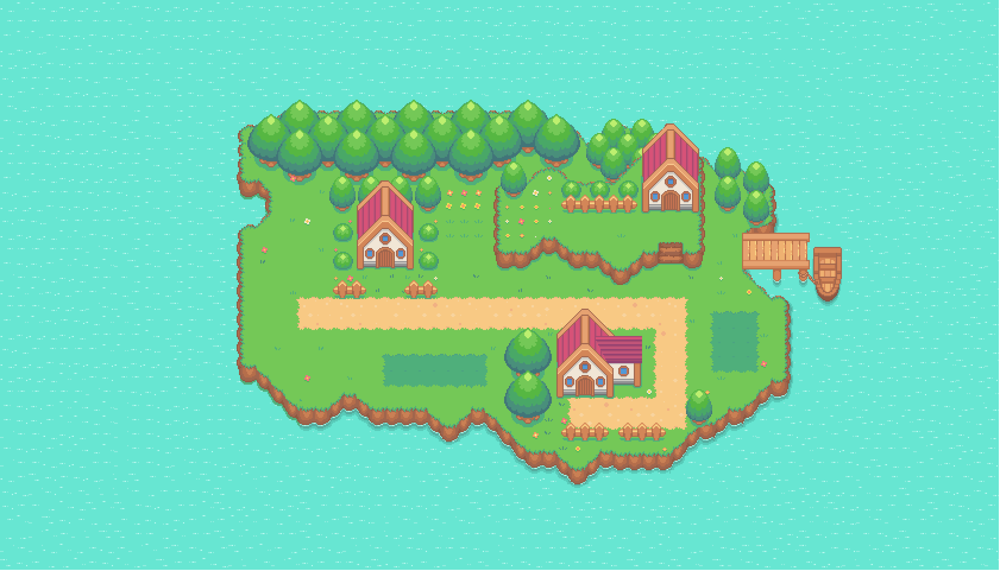

# Pokemon Pikachu

Pokemon Pikachu is a browser game built with HTML, CSS, JavaScript, Canvas, and GSAP. It includes a tile-based overworld, NPC interactions, and a turn-based battle system.

## Completed Features

- Responsive canvas scaling and viewport-safe layout
- Top-down movement with `W`, `A`, `S`, `D`
- Mobile movement buttons for touch devices
- Collision and battle-zone detection on the map
- NPC dialogue system with trainer metadata support
- Turn-based battle flow with transitions and queue-driven actions
- Party system with multiple monsters and active-monster switching
- HP bars, HP text, status text, and live UI updates
- Move system with cooldowns and disabled-button handling
- Status effects: burn, poison, stun, and temporary defense buffs
- Battle dialogue box interactions (click to progress queued actions)
- Wild battle run option and battle exit transitions
- Save/load support for core progress (`battlesWon`)
- Battlefield UI polish: improved message panel and action button styling

## Current Behavior Notes

- On small mobile viewports, wild grass encounters do not auto-enter battle.
- Desktop/tablet view keeps full battle flow enabled.
- Audio hooks are integrated via Howler and used in battle/map events.

## Controls

| Key | Action |
| --- | --- |
| `W`, `A`, `S`, `D` | Move around the map |
| `Space` | Talk / advance NPC dialogue |
| `1`, `2`, `3` | Switch party monster during battle |
| Mobile buttons | Move on touch devices |
| Mouse click | Use battle actions and advance dialogue |

## Tech Stack

- HTML5
- CSS3
- JavaScript
- Canvas
- GSAP
- Howler.js

Note:
Mobile responsiveness not there for mobile because it was unable to render sprites for the battle field in the mobile. I tried a lot.
 Credits for help:
 sprites and audio credits:https://drive.google.com/drive/folders/1cbdyXiO7IlIDgSDul6yMvFrJ-acQgJjf  -->